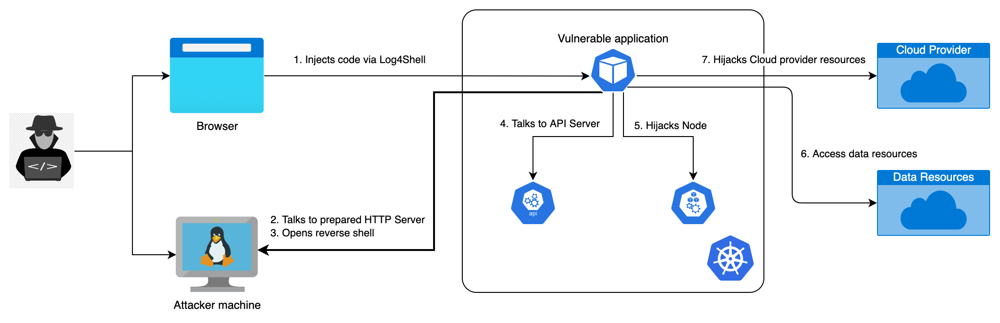

# Hijack a Kubernetes Cluster

This repo contains samples and code used to demo Container and Kubernetes security. The hands-on is based on Azure, but should be easily adaptable to other cloud providers.

> This project contains anti-patterns!

## Environment

Details on how to scaffold the demo environment are available [here](./docs/env.md).

## Hands-on

The hands-on guide is available [here](./docs/hands-on.md).
